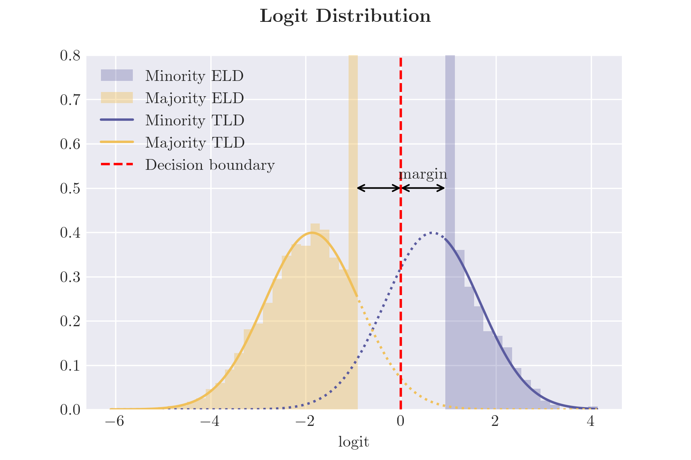

# Imbalanced_Classification

Reproduction code for the paper:

> Jingyang Lyu, Kangjie Zhou, and Yiqiao Zhong. [**A statistical theory of overfitting for imbalanced classification.**](https://arxiv.org/abs/2502.11323) *arXiv preprint arXiv:2502.11323* (2025).



[**Code for the figure (Google Colab notebook)**](https://colab.research.google.com/drive/1DQ1HvOtRCb8fXw6TBF3-Pc9Ozdv5kEM5?usp=sharing)

## Repository Structure

The repository is organized into the following modules:

- `data`: Contains preprocessed datasets used directly in our analysis.

  - Preprocessed IFNB single-cell RNA-seq dataset. 
  - Features and labels of CIFAR-10 dataset, preprocessed by pretrained ResNet-18 model.
  - Features and labels of IMDb movie review dataset, preprocessed by BERT base model (110M).

  Temporary data may also be stored here when running other modules.

- `m0_Preprocessing`: Code for preprocessing raw data. The processed data has been stored in the `data` folder, while some raw data may also be stored there during execution.

- `m1_Logit_distribution_binary`: Generates empirical logit distribution (ELD) and test logit distribution (TLD) for binary SVM and logistic regression.

  - Simulation (Figure 1).
  - Real data analysis (Figure 2).

- `m2_Logit_distribution_multiclass`: Generates joint ELD and TLD for multinomial logistic regression.

  - Simulation and data analysis (Figure 9).

- `m3_Qualitative_analysis`: Conducts qualitative analysis of test errors and uncertainty quantification.

  - Simulation (Figures 4, 5, and 7).

- `m4_High_imbalance`: Visualizes phase transition in high-imbalance regimes.

  - Simulation (Figure 6).

- `m5_Calibration_reliability`: Generates calibration reliability diagrams.

  - Simulation (Figures 8, 10, and 11).
  - Real data analysis (Figure 12).

- `m6_Miscellaneous`: Contains code for additional plots.

  - Schematic illustration of margin-rebalanced SVM (Figure 3).
  - Function plot of the proximal operator (Appendix A, Figure 13).
  - Function plot for monotonicity analysis (Appendix G, Figure 14).

Each module is executed through one or more `.ipynb` files and runs independently, provided its relative path to the `data` folder remains unchanged. Figures will be saved in the same folder (or a subfolder) as the corresponding `.ipynb` file.

BibTeX Citation:

```latex
@misc{lyu2025statisticaltheoryoverfittingimbalanced,
      title={A statistical theory of overfitting for imbalanced classification}, 
      author={Jingyang Lyu and Kangjie Zhou and Yiqiao Zhong},
      year={2025},
      eprint={2502.11323},
      archivePrefix={arXiv},
      primaryClass={math.ST},
      url={https://arxiv.org/abs/2502.11323}, 
}
```
